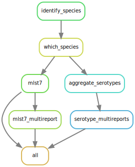

[](https://github.com/RIVM-bioinformatics/Juno-typing/actions/workflows/juno_typing_test.yaml)

<div align="center">
    <h1>Juno-typing</h1>
    <br />
    <h2>Typing tools (7-locus MLST and serotyping) for different bacterial genera/species.</h2>
    <br />
    
</div>

## Pipeline information

* **Author(s):**            Alejandra Hernández Segura, Roxanne Wolthuis, Karim Hajji
* **Organization:**         Rijksinstituut voor Volksgezondheid en Milieu (RIVM)
* **Department:**           Infektieziekteonderzoek, Diagnostiek en Laboratorium Surveillance (IDS), Bacteriologie (BPD)
* **Start date:**           01 - 03 - 2021
* **Commissioned by:**      Maaike van den Beld

## About this project

The goal of this pipeline is to perform bacterial typing (7-locus MLST and serotyping). It takes 2 types of files per sample as input:
1. Two ‘.fastq’ files (paired-end sequencing) derived from short-read sequencing. They should be already filtered and trimmed (for instance, with the Juno-pipeline).
2. An assembly from the same sample in the form of a single ‘.fasta’ file.

Importantly, the Juno-typing pipeline works directly on output generated from the [Juno-assembly pipeline](https://github.com/RIVM-bioinformatics/Juno_pipeline).

The Juno-typing pipeline will then perform the following steps:  

1. The appropriate 7-locus MLST schema and eventually a serotyper. The supported species for the 7-locus MLST can be found in the [database](https://bitbucket.org/genomicepidemiology/mlst_db/src/master/) generated by the [Center for Genomic Epidemiology](http://genomicepidemiology.org/) from the Technical University of Denmark.
2. 7-locus MLST by using the [MLST](https://bitbucket.org/genomicepidemiology/mlst/src/master/) tool.
3. If appropriate for the genus/species, the samples will be serotyped. The currently supported species are:
    - _Salmonella_ serotyper by using the [SeqSero2](https://journals.asm.org/doi/10.1128/aem.01746-19?permanently=true&) tool.
    - _E. coli_ serotyper by using the [SerotypeFinder](https://bitbucket.org/genomicepidemiology/serotypefinder/src/master/) tool.
    - _S. pneumoniae_ serotyper by using the [Seroba](https://github.com/sanger-pathogens/seroba) tool.
    - _Shigella_ serotyper by using the [ShigaTyper](https://github.com/CFSAN-Biostatistics/shigatyper) tool.
    - _Neisseria_ serotyper by using the [Capsule Characterization Neisseria](https://github.com/ntopaz/characterize_neisseria_capsule) tool.



## Prerequisities

* **Linux + conda** A Linux-like environment with at least 'miniconda' installed. 
* **Python3.7.6** .


## Installation

1. Clone the repository:

```
git clone https://github.com/RIVM-bioinformatics/Juno-typing.git
```
Alternatively, you can download it manually as a zip file (you will need to unzip it then).

2. Enter the directory with the pipeline and install the master environment:

```
cd Juno-typing
conda env create -f envs/master_env.yaml
```

## Parameters & Usage

### Command for help

* ```-h, --help``` Shows the help of the pipeline

### Required parameters

* ```-i, --input``` Directory with the input (fasta) files. The fasta files should be all in this directory (no subdirectories) and have the extension '.fasta'. 

### Optional parameters

* `-s --species` Species for ALL samples (it assumes all of them are the same species). It should be two words (e.g Salmonella enterica or Escherichia coli). If a metadata file is also provided, the `-s` argument will take precedence and be used instead. The species is used to choose the scheme for MLST7 and the appropriate serotyper (if any).
* `-m --metadata` Relative or absolute path to a csv file containing at least one column with the 'sample' name (name of the file but removing [_S##]_R1.fastq.gz), a column called 'genus' and a column called 'species' (Note that the sample names are written in small letters, not a single capital letter). If none is given and the input directory contains a file called '<input_dir>/identify_species/top1_species_multireport.csv' (as obtained with the Juno-assembly pipeline) this will be used as metadata. If a species is provided for a sample, it will overwrite the metadata when choosing the scheme for MLST and the serotyper. Example metadata file:


| __sample__ | __genus__ | __species__ |
| :---: | :--- | :--- |
| sample1 | salmonella | enterica |

*Note:* The fastq files corresponding to this sample would probably be something like sample1_S1_R1_0001.fastq.gz and sample2_S1_R1_0001.fastq.gz and the fasta file sample1.fasta. Also note that the column titles of the metadata.csv file are all in lower case.

* ```-o --output``` Directory (if not existing it will be created) where the output of the pipeline will be collected. The default behavior is to create a folder called 'output' within the pipeline directory. 
* ```-d --db_dir``` Directory (if not existing it will be created) where the databases used by this pipeline will be downloaded or where they are expected to be present. Default is '/mnt/db/juno/typing_db' (internal RIVM path to the databases of the Juno pipelines). It is advisable to provide your own path if you are not working inside the RIVM Linux environment.
* `--serotypefinder_mincov` Minimum coverage (ranging from 0-1) used by SerotypeFinder to identify the appropriate alleles. Default is 0.6.
* `--serotypefinder_identity` Identity threshold to be used for identifying alleles by SerotypeFinder (ranging from 0-1). Default is 0.85.
* `--seroba_mincov` Minimum coverage (ranging from 0-100) used by Seroba to identify the appropriate alleles. Default is 20.
* `--seroba_kmersize` Kmersize to be used for building the Seroba database. If you already downloaded the seroba database and built it with a different kmersize you have to either delete it first or use the `--update` flag together with this option. Default is 71.
* ```-c --cores```  Maximum number of cores to be used to run the pipeline. Defaults to 300 (it assumes you work in an HPC cluster).
* ```-l --local```  If this flag is present, the pipeline will be run locally (not attempting to send the jobs to a cluster). Keep in mind that if you use this flag, you also need to adjust the number of cores (for instance, to 2) to avoid crashes. The default is to assume that you are working on a cluster because the pipeline was developed in an environment where it is the case.
* ```-q --queue```  If you are running the pipeline in a cluster, you need to provide the name of the queue. It defaults to 'bio' (default queue at the RIVM). 
* ```-n --dryrun```, ```-u --unlock``` and ```--rerunincomplete``` are all parameters passed to Snakemake. If you want the explanation of these parameters, please refer to the [Snakemake documentation](https://snakemake.readthedocs.io/en/stable/).
* `--update` If this flag is present, the databases will be re-downloaded even if they are present already.

### The base command to run this program. 

```
python juno_typing.py -i [dir/to/input_directory] 
```

### An example on how to run the pipeline.

```
python juno_typing.py -i my_input_files -o my_results --db_dir my_db_dir --metadata path/to/my/metadata.csv --local --cores 2
```

## Explanation of the output

* **log:** Log files with output and error files from each Snakemake rule/step that is performed. 
* **audit_trail:** Information about the versions of software and databases used.
* **output per sample:** The pipeline will create one subfolder per each step performed (identify_species, mlst7, serotype). These subfolders will in turn contain another subfolder per sample. To understand the output, please refer to the manuals of each individual tool. Inside the serotype folder, there will be generated a .csv file that summarizes the results of all the samples for each serotyper that has run(serotype_multireport.csv, serotype_multireport1.csv, serotype_multireport2.csv, serotype_multireport3.csv).
        
## Issues  

* All default values have been chosen to work with the RIVM Linux environment, therefore, there might not be applicable to other environments (although they should work if the appropriate arguments/parameters are given).
* Any issue can be reported in the [Issues section](https://github.com/RIVM-bioinformatics/Juno-typing/issues) of this repository.

## Future ideas for this pipeline

* -

## License
This pipeline is licensed with an AGPL3 license. Detailed information can be found inside the 'LICENSE' file in this repository.

## Contact
* **Contact person:**       Alejandra Hernández Segura
* **Email**                 alejandra.hernandez.segura@rivm.nl

For Shigella or Neisseria related questions:
* **Contact person:**       Roxanne Wolthuis
* **Email**                 roxanne.wolthuis@rivm.nl

